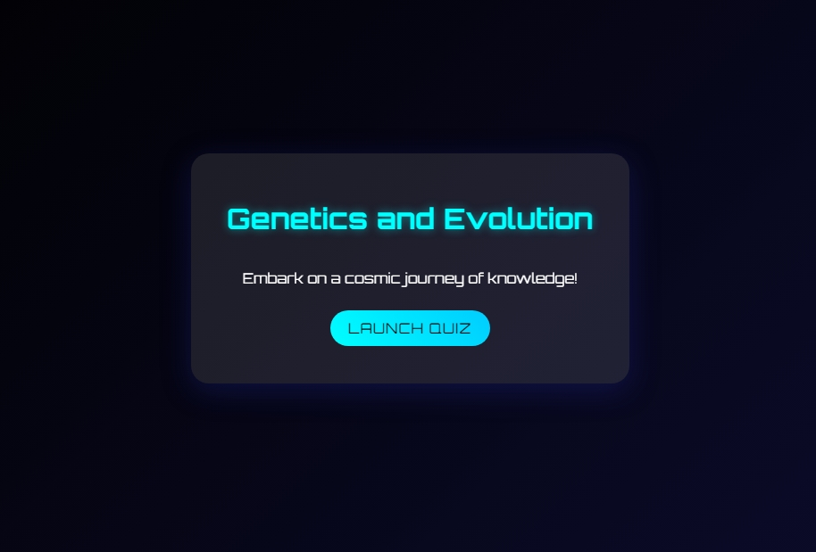
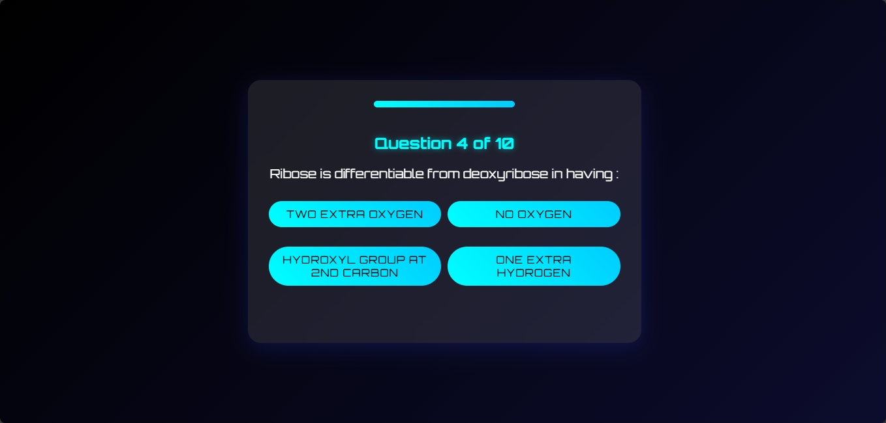
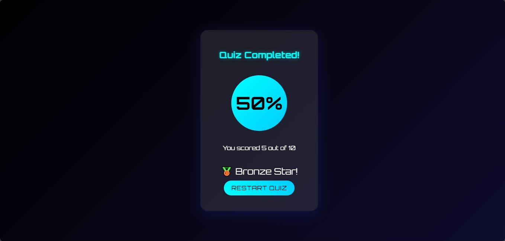

# Space Quiz Adventure

Space Quiz Adventure is an engaging and interactive quiz application with a cosmic theme, built using React and Tailwind CSS. This project was developed as part of a Web Developer Intern assignment.

## Project Overview

Space Quiz Adventure takes users on a journey through space-themed questions, providing an immersive and educational experience. The app features a sleek, modern UI with a responsive design suitable for various screen sizes.

## Key Features

- Fetches quiz data from an external API
- Interactive quiz flow with multiple-choice questions
- Progress tracking during the quiz
- Score calculation and result summary
- Streak counter for consecutive correct answers
- Achievement badges on the result screen
- Confetti animation on quiz completion
- Error handling and loading states
- Responsive design for mobile and desktop

## Technologies Used

- React
- Tailwind CSS
- Vite (for project setup and build)
- canvas-confetti (for celebration effects)

## Setup Instructions

1. Clone the repository:

   ```sh
   git clone https://github.com/your-username/space-quiz-adventure.git
   cd space-quiz-adventure
   ```

2. Install dependencies:

   ```sh
   npm install
   ```

3. Start the development server:

   ```sh
   npm run dev
   ```

4. Open your browser and navigate to `http://localhost:5173` to view the app.

## API Integration

The app fetches quiz data from the API endpoint: `https://api.jsonserve.com/Uw5CrX`. Ensure that this endpoint is accessible and returns the expected data format.

## Building for Production

To create a production build, run:

```sh
npm run build
```

The built files will be in the `dist` directory. You can then deploy these files to a web server of your choice.

## Project Structure

```
space-quiz-adventure/
├── src/
│   ├── components/
│   │   ├── ErrorScreen.jsx
│   │   ├── LoadingScreen.jsx
│   │   ├── QuizScreen.jsx
│   │   ├── ResultScreen.jsx
│   │   └── StartScreen.jsx
│   ├── App.jsx
│   ├── api.js
│   └── main.jsx
├── index.html
├── package.json
├── vite.config.js
├── README.md
```

## Future Improvements

- Add more questions and categories
- Implement user authentication and score tracking
- Create a leaderboard system
- Add sound effects and background music
- Implement difficulty levels

## Screenshots

Here are some screenshots of the Space Quiz Adventure in action:






## Contributing

Contributions are welcome! Please feel free to submit a Pull Request.

## License

This project is open source and available under the [MIT License](LICENSE).
